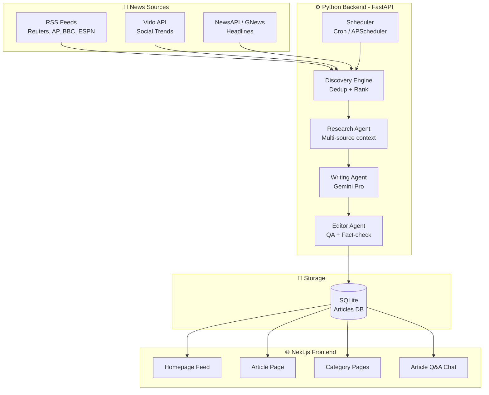

# 🗺️ AetherNews — Development Roadmap

> **AI-Native Autonomous Newsroom**
> Build window: March 30 – April 6, 2026
> Stack: Next.js (frontend) + Python/FastAPI (backend) + Gemini API + Virlo API

---

## 📐 Architecture Overview



---

## 📁 Project Structure

```
aethernews/
├── backend/                    # Python backend
│   ├── main.py                 # FastAPI app entry point
│   ├── config.py               # API keys, settings, env vars
│   ├── requirements.txt        # Python dependencies
│   │
│   ├── sources/                # News source connectors
│   │   ├── __init__.py
│   │   ├── rss_source.py       # RSS feed parser
│   │   ├── virlo_source.py     # Virlo API trending topics
│   │   └── newsapi_source.py   # NewsAPI/GNews connector
│   │
│   ├── pipeline/               # AI editorial pipeline
│   │   ├── __init__.py
│   │   ├── discovery.py        # Story dedup, ranking, selection
│   │   ├── researcher.py       # Multi-source research agent
│   │   ├── writer.py           # Gemini article writer
│   │   ├── editor.py           # QA / editorial pass
│   │   └── prompts.py          # All LLM prompt templates
│   │
│   ├── models/                 # Data models
│   │   ├── __init__.py
│   │   └── schemas.py          # Pydantic models for articles, sources
│   │
│   ├── database/               # Database layer
│   │   ├── __init__.py
│   │   ├── db.py               # DB connection + setup
│   │   └── crud.py             # Create/read operations
│   │
│   ├── api/                    # API routes
│   │   ├── __init__.py
│   │   ├── articles.py         # Article endpoints
│   │   └── chat.py             # Article Q&A endpoint
│   │
│   └── scheduler.py            # APScheduler - runs pipeline on cron
│
├── frontend/                   # Next.js app
│   ├── package.json
│   ├── next.config.js
│   ├── public/                 # Static assets
│   ├── src/
│   │   ├── app/                # App router pages
│   │   │   ├── layout.js       # Root layout + fonts
│   │   │   ├── page.js         # Homepage
│   │   │   ├── article/
│   │   │   │   └── [slug]/
│   │   │   │       └── page.js # Individual article page
│   │   │   ├── category/
│   │   │   │   └── [name]/
│   │   │   │       └── page.js # Category listing
│   │   │   └── api/            # Next.js API proxy (optional)
│   │   │
│   │   ├── components/         # React components
│   │   │   ├── Header.js       # Nav bar
│   │   │   ├── Footer.js
│   │   │   ├── ArticleCard.js  # Feed card
│   │   │   ├── ArticleBody.js  # Full article renderer
│   │   │   ├── CategoryNav.js  # Category tabs/pills
│   │   │   ├── TrendingBar.js  # Virlo trending sidebar
│   │   │   ├── ChatPanel.js    # Article Q&A (bonus)
│   │   │   └── HeroArticle.js  # Featured article
│   │   │
│   │   └── styles/
│   │       └── globals.css     # Design system
│   │
│   └── .env.local              # Frontend env vars
│
├── .env                        # Root env vars (API keys)
├── .gitignore
└── roadmap.md
```

---

## 🔨 Step-by-Step Build Plan

---

### Phase 1: Project Setup *(CURRENTLY PARTIALLY DONE)*
- [x] Initialize the monorepo
- [x] Set up Python backend dependencies
- [ ] Set up Next.js frontend

### Phase 2: News Source Connectors *(DONE)*
- [x] RSS feed source (`rss_source.py`)
- [x] Virlo Trending Source (`virlo_source.py`)
- [x] Unified source interface (`__init__.py`)

### Phase 3: AI Editorial Pipeline *(DONE)*
- [x] Discovery Engine (`discovery.py`)
- [x] Research Agent (`researcher.py`)
- [x] Writing Agent (`writer.py` using Gemini)
- [x] Editor QA Agent (`editor.py` using Gemini)
- [x] Prompt templates (`prompts.py`)

### Phase 4: Database & API *(DONE)*
- [x] Database setup (`database/db.py`)
- [x] CRUD operations (`crud.py`)
- [x] API routes (`api/articles.py`)
- [ ] Article Q&A endpoint (Bonus to add later)

### Phase 5: Scheduler *(DONE)*
- [x] APScheduler setup (`scheduler.py`) to run pipeline every 2 hours

### Phase 6: Frontend — Homepage & Feed *(NEXT UP)*
- [ ] Design system (`globals.css`)
- [ ] Layout (`layout.js`)
- [ ] Homepage (`page.js`)
- [ ] Feed Components (`ArticleCard`, `TrendingBar`)

### Phase 7: Frontend — Article Page
- [ ] Full article template (`article/[slug]/page.js`)
- [ ] Category filtering (`category/[name]/page.js`)

### Phase 8: Virlo Deep Integration
- [ ] Interactive Trending Stories Sidebar
- [ ] Social Context Box inside Articles

### Phase 9: Deployment
- [ ] Deploy backend to free hosting (Railway/Render)
- [ ] Deploy frontend to Vercel
- [ ] Ensure end-to-end automation works live with HTTPS

---

## 📰 News Categories (5)

1. **Tech & AI** — Gemini's strong suit, always trending
2. **Business & Finance** — Serious reporting credibility
3. **Sports** — Massive social engagement, real-time events *(Updated per request!)*
4. **Culture & Entertainment** — Virlo's sweet spot (social trends)
5. **World & Politics** — Gravitas, signals "real newsroom"

---
